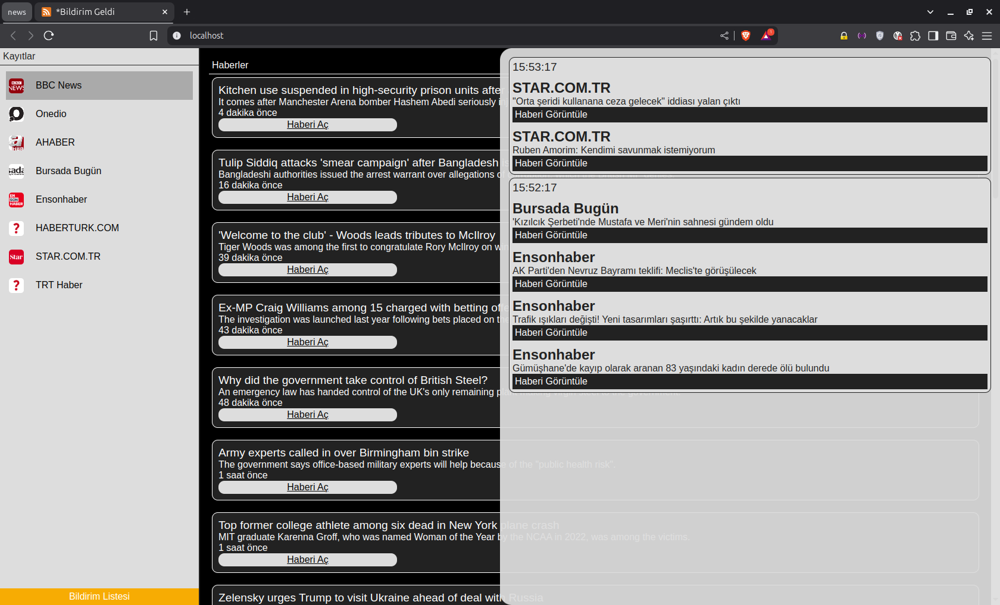

# RSS Feed Notifier

A simple open-source RSS feed notifier that fetches and monitors your selected RSS sources. It notifies you with visual popups and sound alerts whenever new content appears since your last check.

## Features

- 🔄 Automatically fetches RSS feeds every **1 minute**
- 🔔 **Sound alerts** when new feed items appear
- 🆕 Shows only new feed items since the last update
- 📋 Lets you choose which RSS sources to monitor
- 🧩 Clean, simple interface and easy setup
- 📦 Fully open-source and lightweight

## Getting Started

`git clone https://github.com/f10tme/rss-feed.git`

`cd rss-feed`

`npm install`

`npm start`

**Runs as administrator**
`npm sudo`